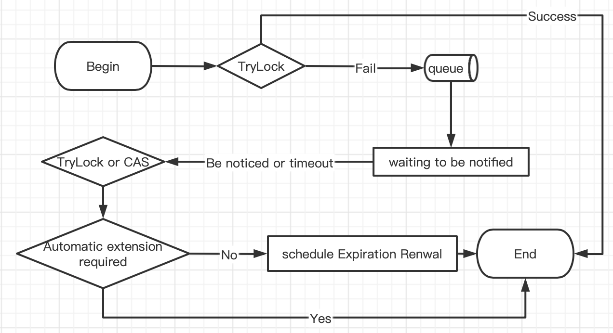

English | [中文](./Readme-CN.md)

# DisGo Introduce
DisGo is a distributed lock based on Redis, developed in Golang language. The name comes from `Distributed`, `Disco` and `Golang`, I wish you all to write code as easy as dancing disco.

# Features of DisGo

### **Reentrant Lock**
DisGo is a reentrant lock. It uses the Redis's Hash type as the lock, the hash-name is the lock name, the hash-key stores the unique id of the current lock-holding thread, and the hash-value stores the current number of locks.

### **Fair Lock**
Golang itself does not have thread-safe queues to use. For convenience, DisGo uses Redis's ZSet to simulate queues, which ensures first-in first-out(FIFO) to a certain extent and provides a fair lock.

### **Auto-Renew**
DisGo provides an automatic renewal function to prevent data errors caused by early release of locks before business execution is completed.

### **Spin Lock**
DisGo is a spin lock, which will automatically retry the lock grab within the set waiting time until the lock is grabbed or the wait times out.

### **More Efficient**
DisGo uses Redis's publish and subscribe, and will receive the message as soon as the lock is released, and then execute the lock according to the order of the waiting queue.

# DisGo locking process
<details>
<summary>Click Me</summary>


</details>


# API Introduction
#### Acquire lock object
```go
    redisClient := redis.NewClient(&redis.Options{
        Network: "tcp",
        Addr:    "127.0.0.1:6379",
    })
    lock := disgo.GetLock(redisClient, "test")
```

#### Ordinary lock (no spin lock and automatic renewal required)
```go
    success, err := lock.Lock(ctx, 5*time.Second, 10*time.Second)
```

#### Spin-locked (no auto-renewal required)
```go
    success, err := lock.TryLock(ctx, 5*time.Second, 10*time.Second)
```

#### Spin lock (auto-renew)
```go
    success, err := lock.TryLockWithSchedule(ctx, 5*time.Second)
```

#### Unlock (Universal)
```go
    success, err := lock.Release(ctx)
```